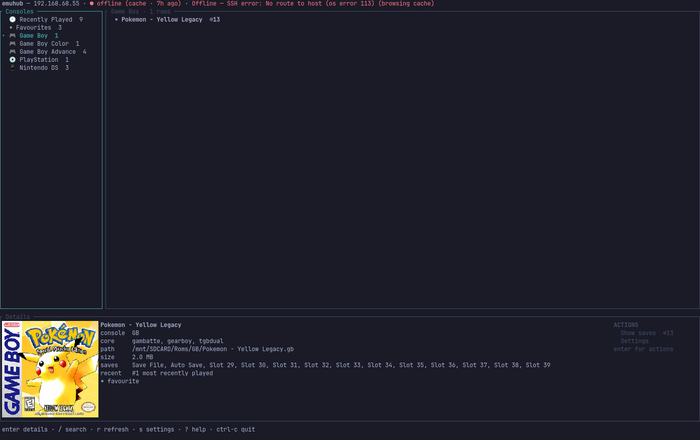

# emuhub

Browse your Miyoo Mini+ ROM library, sync favourites, and check your save states — from the terminal,
over SSH. Box art included.

<!-- Replace with a real capture: docs/screenshot.png -->
<!--  -->

`emuhub` connects to a **Miyoo Mini+ running [Onion OS](https://onionui.github.io/)** over SSH/SFTP and
gives you a three-pane TUI over the whole SD card: consoles, games, and a detail pane with box art.
It's a Rust rewrite of [`glennbarosen/emuhub`](https://github.com/glennbarosen/emuhub), a SwiftUI
macOS/iOS app, built so it runs anywhere a terminal does.

## Features

- **Browse the whole library by console**, scanned in a single round trip rather than one per console.
- **Fuzzy search across every console at once** with `/`.
- **Favourites**, written back to the device in the exact format Onion expects.
- **Recently Played**, read from the device's own play history.
- **Save-state browser** with thumbnails — including the ones RetroArch files under core names where
  you'd never find them by hand.
- **Box art in the terminal** via the Kitty graphics protocol, with a halfblock fallback everywhere
  else.
- **Rename and delete that clean up after themselves** — box art, save states and their thumbnails,
  favourite and recent entries, and Onion's per-console cache DB all move with the ROM.
- **Finds your handheld on the network** if you don't know its IP.
- **Works offline.** The library is cached locally, so it opens instantly and browses fine with the
  handheld asleep in a drawer.

## Requirements

- A Miyoo Mini+ running Onion OS, on the same network, with SSH enabled
  (`Apps › Tweaks › Network › SSH`).
- A terminal. For box art at full quality, one that speaks the Kitty graphics protocol — Ghostty, Kitty,
  WezTerm. Everything else falls back to halfblocks and still works.

Linux and macOS are built and tested. Windows isn't — nothing in the code is Unix-specific, so it may
well build, but nobody has tried it.

## Install

### Arch / Omarchy — AUR

```bash
yay -S emuhub-tui-bin
```

### Anywhere else — install script

```bash
curl -fsSL https://raw.githubusercontent.com/glennbarosen/emuhub-tui/main/install.sh | sh
```

Downloads the release binary for your platform, verifies its checksum, and puts `emuhub` in
`~/.local/bin`. Set `EMUHUB_INSTALL_DIR` to put it somewhere else. Prebuilt binaries are also on the
[releases page](https://github.com/glennbarosen/emuhub-tui/releases) if you'd rather do it by hand.

### With a Rust toolchain

```bash
cargo install --git https://github.com/glennbarosen/emuhub-tui --bin emuhub
```

Expect this to take a while — the release profile uses full LTO over a crypto-heavy dependency tree.
The prebuilt binaries above are the same build, already compiled.

## Usage

```bash
emuhub               # connect to the saved host
emuhub 192.168.1.50  # set (and remember) the device address
```

Don't know the IP? Start `emuhub`, press `s`, and choose **Find device on network** — it sweeps your
local subnet for something answering on port 22 that looks like a Miyoo.

### Keys

| Key | |
|---|---|
| `j` `k` / `↑` `↓` | Move |
| `h` `l` / `←` `→` | Back / forward a pane |
| `enter` | Into a pane · run the selected action |
| `esc` | Back out one level |
| `g` / `G` | Jump to first / last |
| `/` | Fuzzy search every console at once |
| `r` | Refresh the library from the device |
| `s` | Settings — reconnect, change IP, find device |
| `?` | Help |
| `ctrl-c` | Quit |
| `q` / `esc` | Close an overlay |
| `y` | Confirm a delete (any other key cancels) |

Per-game actions — saves, favourite, rename, delete — deliberately have **no keyboard shortcuts**.
Press `enter` on a game to reach them in the Details pane. One route to each action beats a menu plus a
set of hidden keys that drift out of sync with it.

`ctrl-c` is the only way to quit, on purpose: `q` closes overlays but does nothing in the browser, so a
mistyped key can't end your session.

### Files it writes

| | |
|---|---|
| `~/.config/emuhub/config.toml` | `host`, `port` (22), `username` (`root`), `image_cache_max_mb` (200) |
| `~/.local/state/emuhub/` | Library, favourites, recents and save-state cache |
| `~/.cache/emuhub/` | Box art and save-state thumbnails, pruned to the size cap on exit |

Nothing outside these three directories, and nothing that a package manager or OS update will disturb.

## Before you delete anything

Renaming or deleting a ROM touches several files across the card — see
[`docs/DEVICE-PROTOCOL.md` §6](docs/DEVICE-PROTOCOL.md) for exactly which. `emuhub` computes the full
list up front and shows it in the confirmation dialog, takes a `.bak` before overwriting any of the
device's JSON, and renames Onion's cache DB rather than deleting it.

That's a real safety net, not a guarantee. **Back up your SD card before letting any new tool write to
it**, this one included.

## A note on security

`emuhub` authenticates as `root` with an empty password, and does not verify the device's host key.

That isn't a shortcut — it's what Onion OS ships, and there's no way to set a password through the stock
UI. It's a reasonable trade for a games handheld on your own LAN, and it is **not** reasonable over the
open internet. Don't port-forward your Miyoo, and don't point `emuhub` at anything reachable from
outside your network.

## Building from source

```bash
cargo build --workspace
cargo test --workspace     # 139 tests, no hardware needed
cargo run -p emuhub-tui --bin emuhub -- <device-ip>
```

Requires Rust 1.88 or newer. There's also a `spike` binary for poking at a device without the TUI in the
way — connectivity, box art, play history, and a raw dump of the save tree:

```bash
cargo run -p emuhub-tui --bin spike -- <device-ip>
```

## Documentation

- **[`docs/DEVICE-PROTOCOL.md`](docs/DEVICE-PROTOCOL.md)** — where Onion OS keeps everything on the SD
  card, and the four quirks that make writing to it non-obvious. Useful even if you never run this app;
  it isn't written down anywhere else.
- **[`AGENTS.md`](AGENTS.md)** — architecture map and the bugs already hit once, for contributors.

## License

MIT — see [LICENSE](LICENSE).

Thanks to the [Onion OS](https://onionui.github.io/) team, whose work this is built on top of.
